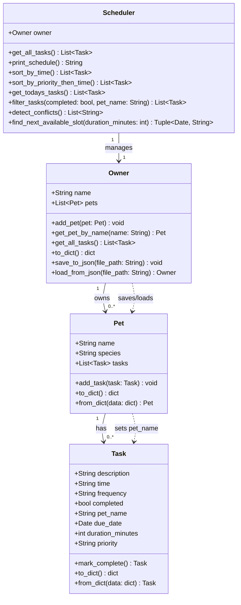
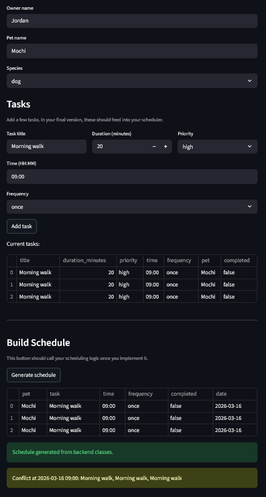

# PawPal+ (Module 2 Project)

You are building **PawPal+**, a Streamlit app that helps a pet owner plan care tasks for their pet.

## Scenario

A busy pet owner needs help staying consistent with pet care. They want an assistant that can:

- Track pet care tasks (walks, feeding, meds, enrichment, grooming, etc.)
- Consider constraints (time available, priority, owner preferences)
- Produce a daily plan and explain why it chose that plan

Your job is to design the system first (UML), then implement the logic in Python, then connect it to the Streamlit UI.

## What you will build

Your final app should:

- Let a user enter basic owner + pet info
- Let a user add/edit tasks (duration + priority at minimum)
- Generate a daily schedule/plan based on constraints and priorities
- Display the plan clearly (and ideally explain the reasoning)
- Include tests for the most important scheduling behaviors

## Getting started

### Setup

```bash
python -m venv .venv
source .venv/bin/activate  # Windows: .venv\Scripts\activate
pip install -r requirements.txt
```

### Suggested workflow

1. Read the scenario carefully and identify requirements and edge cases.
2. Draft a UML diagram (classes, attributes, methods, relationships).
3. Convert UML into Python class stubs (no logic yet).
4. Implement scheduling logic in small increments.
5. Add tests to verify key behaviors.
6. Connect your logic to the Streamlit UI in `app.py`.
7. Refine UML so it matches what you actually built.

## Smarter Scheduling

- `Scheduler.sort_by_time()` keeps a pure chronological view available.
- `Scheduler.sort_by_priority_then_time()` ranks tasks by priority first, then by date/time.
- `Scheduler.find_next_available_slot()` searches for the first gap that fits a requested duration.
- `Scheduler.filter_tasks()` supports filtering by completion state and pet name.
- `Scheduler.detect_conflicts()` returns warnings for tasks that share the same date/time.
- `Task.mark_complete()` creates the next task instance for daily and weekly tasks.
- `Owner.save_to_json()` and `Owner.load_from_json()` persist pets and tasks to `data.json`.

## Agent Mode Notes

- Agent Mode was used to plan the JSON persistence work and the new advanced scheduling algorithm before code changes were applied.
- The agent recommended custom `to_dict()` / `from_dict()` methods instead of a heavier serialization library, which kept the project small and easy to test.
- The agent also recommended preserving `sort_by_time()` for backward compatibility while adding `sort_by_priority_then_time()` and `find_next_available_slot()` as separate methods.

## Testing PawPal+

Run tests with:

```bash
python -m pytest
```

Current tests cover:

- Task completion changes `completed` to `True`.
- Adding a task increases a pet's task count.
- Tasks can be sorted both chronologically and by priority first, then time.
- Daily and weekly recurrence generate the next correct due date.
- Recurring tasks preserve `priority` and `duration_minutes`.
- A `once` task returns `None` from `mark_complete()` (no next occurrence).
- Duplicate pet names raise a `ValueError`.
- Exact-match time conflicts are detected, while different times do not trigger warnings.
- The next-available-slot algorithm finds the first valid gap and returns `None` when a window is full.
- JSON persistence saves and reloads owner, pet, and task data correctly.
- Missing JSON files are handled gracefully by returning a default empty owner.
- Invalid time formats are rejected at task creation.

**Confidence Level: 4/5** — all 17 tests pass. Remaining gaps: overlapping duration conflict warnings across partially overlapping tasks and multi-owner scenarios.

## Features

- **Sorting by time** — `Scheduler.sort_by_time()` returns tasks ordered by date then HH:MM time.
- **Priority-based scheduling** — `Scheduler.sort_by_priority_then_time()` ranks high-priority work ahead of medium and low.
- **Today's schedule** — `Scheduler.get_todays_tasks()` filters to only today's due date.
- **Conflict warnings** — `Scheduler.detect_conflicts()` returns a warning string for every time slot shared by two or more tasks.
- **Daily recurrence** — `Task.mark_complete()` creates the next-day instance (due_date + 1) when frequency is `daily`.
- **Weekly recurrence** — `Task.mark_complete()` creates the next-week instance (due_date + 7) when frequency is `weekly`.
- **Next available slot** — `Scheduler.find_next_available_slot()` scans for the first open window that fits a requested duration.
- **Filtering** — `Scheduler.filter_tasks()` narrows tasks by completion status, pet name, or both.
- **JSON persistence** — `Owner.save_to_json()` and `Owner.load_from_json()` remember pets and tasks between runs.
- **Input validation** — all user-supplied strings are sanitized and validated at construction (OWASP A03).

## Updated UML



## Demo


